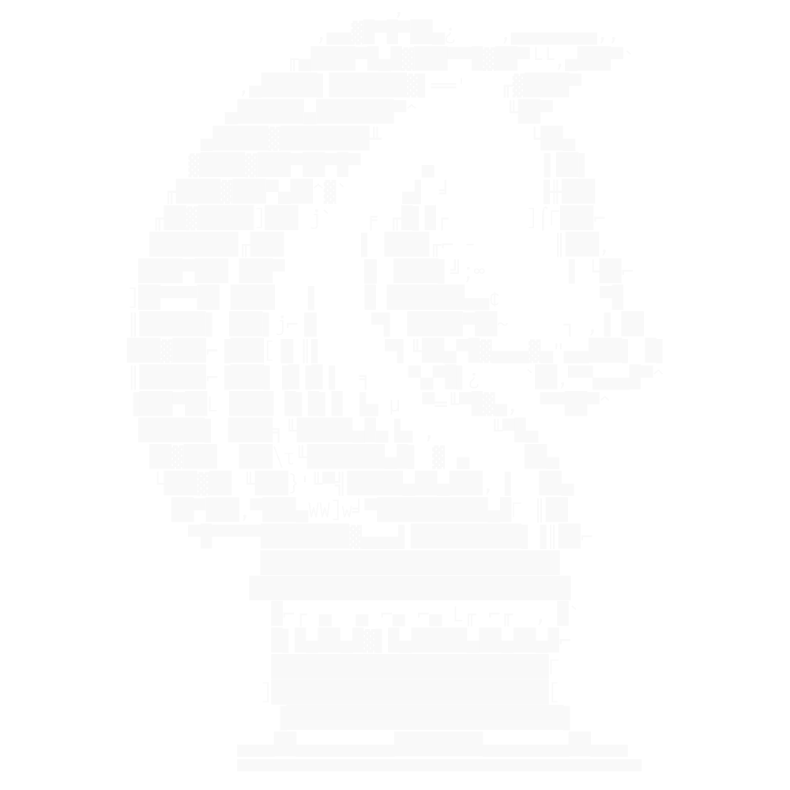
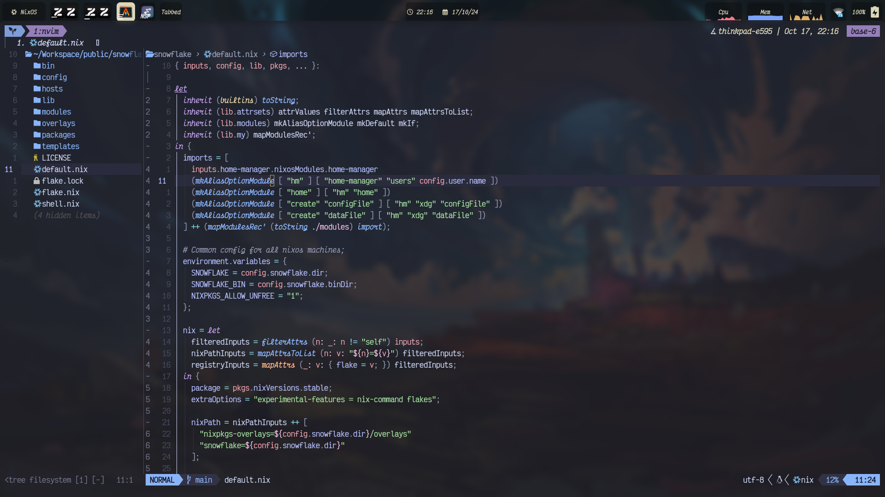

<p align="center">
  
</p>

# Neovim Dotfiles

This repository consists of several branches, where:

1. `Agasaya`: is a lua-based Neovim setup and the one I am mainly running today.

2. `Ereshkigal`: is a lisp-based Neovim setup that relies on [Fennel](https://fennel-lang.org/).

3. `Niflheim`: is a configuration I stitched together with the help of the default
   settings of the installed plugin mentioned in the project's README through nix the package manager.

# Agasaya



Agasaya is a non nix-dependent Neovim configuration file that I crafted myself
and consists mainly of a minimal setup and Neovide settings for the sake of
having a Neovim GUI available.

You might notice that there is a missing `init.lua` file in this folder and the
reason for that is that I have decided to generate it through `home-manager`
(Nix) to automate the theme selection process on desktop theme change!

## Sections

Instead of directly using `require('xyz')`, I have instead chosen to write a
function which requires only when the plugin exists, otherwise it returns
nothing.

```lua
local function prequire(...)
    local success, lib = pcall(require, ...)
    if not (success) then return lib end
    return nil
end
