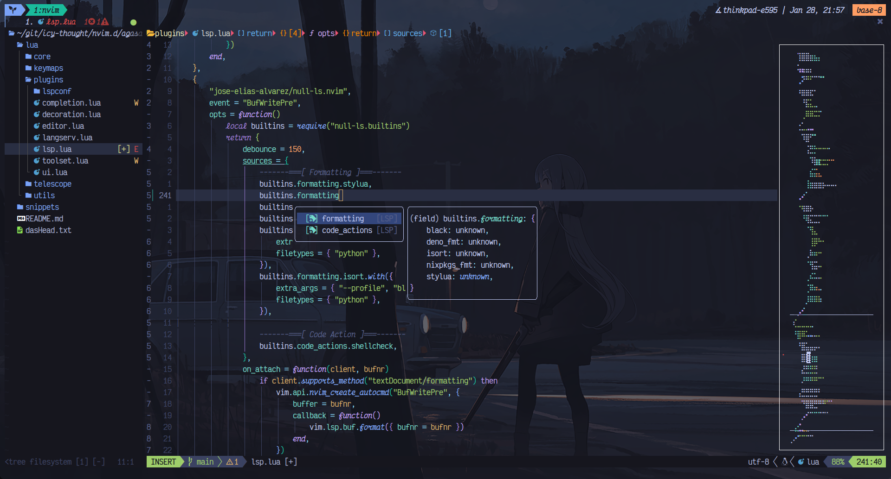

# Table of Contents
- [Greetings from NVIM! 🌒](#greetings-from-nvim-)
- [Sections](##sections)

# Greetings from NVIM! 🌒
Agasaya is a non nix-dependent neovim configuration file that I crafted myself
and consists mainly of a minimal setup and neovide settings for the sake of
having a neovim-gui available.

You might notice that there is a missing `init.lua` file in this folder and the
reason for that is that I have decided to generate it through `home-manager`
(Nix) to automate the theme selection process on desktop theme change!

## Sections
Instead of directly using `require('xyz')`, I have instead chosen to write a
function which requires only when the plugin exists, otherwise it returns
nothing.

```lua
local function prequire(...)
    local success, lib = pcall(require, ...)
    if not (success) then return lib end
    return nil
end
```
