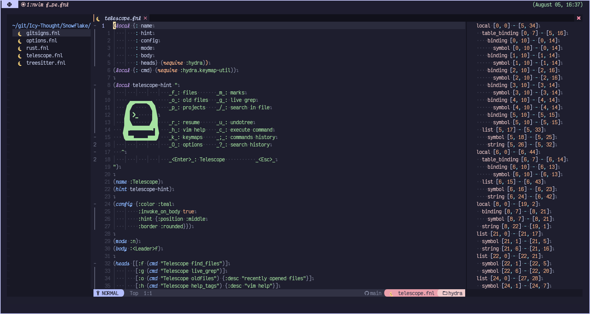

# Table of Contents

- [Greetings from NVIM! 🌒](#greetings-from-nvim-)
- [Sections](##sections)

# Greetings from NVIM! 🌒

`Ereshkigal` is a fennel-based Neovim setup based on
[Nyoom.nvim](https://github.com/shaunsingh/nyoom.nvim)!

> **Note** This repository will go through a rework in the future to match the
> behaviour of my current lua-based neovim configuration.

## Credits

- [Shaunsingh](https://github.com/shaunsingh) - for creating
  [Nyoom.nvim](https://github.com/shaunsingh/nyoom.nvim)!
