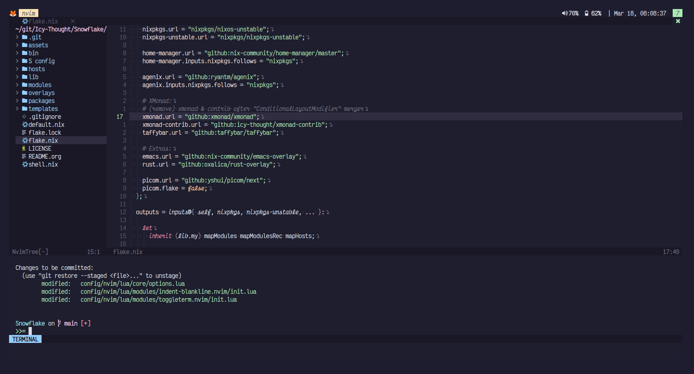

# Table of Contents
- [Greetings from NVIM! 🌒](#greetings-from-nvim-)
  * [Future Announcement](#future-announcement)
  * [Structure](#structure)
- [Sections](#sections)
- [Inspiration](#inspiration)

# Greetings from NVIM! 🌒
## Future Announcement
My nvim configuration will be re-written in Fennel. 
The lisp like syntax is rather appealing compared to Lua. 😏

Whenever that occurs -> I have to bid my farewell to our beloved Emacs.
Why? Because Emacs is not a text editor and what I want is a text editor.

## Structure
At the time of writing, the Neovim configuration files contained within the `lua` folder mostly consists of the recommended settings mentioned in the `README.md` of the installed plugins.
Meanwhile the remaining modifications are written by myself + other Neovim users.

# Sections
Safety feature was added to the first configuration file that attempted to called `local x = require('x)` because of how Nix (Home-Manager) handles the Neovim config.

To explain this, using Neovim through Home-Manager will generate *ONE* large file containing all the plugin configurations placed inside `config/nvim` -> omits the need to re-define it and create a non-useful boilerplate block.

```lua
local function prequire(...)
    local status, lib = pcall(require, ...)
    if (status) then return lib end
    return nil
end
```

# Inspiration
- [Ayamir/nvimdots](https:github.com/ayamir/nvimdots)
- [NTBBloodbath/doom-nvim](https:github.com/NTBBloodbath/doom-nvim)
- [ABZCoding/lvim](https:github.com/abzcoding/lvim)
- [LunarVim/Neovim-from-scratch](https:github.com/LunarVim/Neovim-from-scratch)
